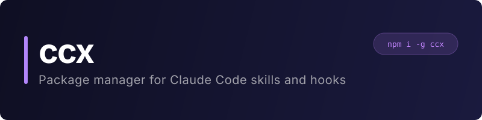

<p align="center">
  
</p>

<p align="center">
  <strong>Install, manage, and update Claude Code skills and hooks with one command.</strong>
</p>

<p align="center">
  <a href="https://www.npmjs.com/package/ccx"></a>
  <a href="https://github.com/Harry89453/ccx/actions"></a>
  <a href="https://github.com/Harry89453/ccx/blob/main/LICENSE"></a>
</p>

---

## The problem

Claude Code skills are the fastest-growing category in open source right now. Repos like [andrej-karpathy-skills](https://github.com/forrestchang/andrej-karpathy-skills) (126K stars) and [mattpocock/skills](https://github.com/mattpocock/skills) (75K stars) prove the demand. But installing any of them means manually cloning repos, copying files into `~/.claude/`, and hoping you got the right ones. There is no versioning, no updates, no discoverability.

**ccx fixes that.** One command to search. One command to install. One command to update everything.

## Demo

<!-- Record a 30-second terminal demo using asciinema or vhs and replace this section:
     1. Run: asciinema rec demo.cast
     2. Show: ccx search design -> ccx install karpathy -> ccx ls -> ccx update
     3. Convert: agg demo.cast demo.gif
     4. Replace this comment block with: 
-->

```
$ ccx search design
  Found 2 packages:

  ui-ux-pro-max@1.0.0 [77,000 stars]
  AI skill providing design intelligence for professional UI/UX across web and mobile
  https://github.com/nextlevelbuilder/ui-ux-pro-max-skill

  design-md@1.0.0 [75,000 stars]
  DESIGN.md files for coding agents to generate matching UIs
  https://github.com/VoltAgent/awesome-design-md

$ ccx install karpathy caveman
  info installing karpathy@1.0.0...
  done karpathy@1.0.0 (1 file)
  info installing caveman@1.0.0...
  done caveman@1.0.0 (1 file)

$ ccx ls
  2 packages installed:

  karpathy@1.0.0
  installed just now from https://github.com/forrestchang/andrej-karpathy-skills
  1 file, type: skill

  caveman@1.0.0
  installed just now from https://github.com/JuliusBrussee/caveman
  1 file, type: skill
```

## Quickstart

```sh
npm install -g ccx
ccx search coding
ccx install karpathy
```

That is it. The skill is now in `~/.claude/skills/karpathy/` and active in your next Claude Code session.

## Commands

| Command | Description |
|---------|-------------|
| `ccx search <query>` | Search the registry by name, description, or tag |
| `ccx install <name> [names...]` | Install one or more packages |
| `ccx uninstall <name> [names...]` | Remove installed packages |
| `ccx update [names...]` | Update all or specific packages to latest |
| `ccx ls` | List installed packages |
| `ccx init` | Scaffold a CLAUDE.md in the current directory |

### Options

- `ccx install --force` -- reinstall even if already present
- `ccx --version` -- print version
- `ccx --help` -- show help for any command

## How it works

1. **Registry**: A curated JSON index hosted on GitHub lists available packages with metadata (name, version, repo, tags, star count).
2. **Install**: ccx fetches the skill/hook files from the package's GitHub repo via the API and writes them to `~/.claude/skills/<name>/` or `~/.claude/hooks/<name>/`.
3. **Lock file**: `~/.claude/ccx-lock.json` tracks what is installed, versions, and file manifests.
4. **Update**: ccx compares installed versions against the registry and replaces outdated packages.

No build steps. No compilation. Skills are plain files (Markdown, YAML, shell scripts) that Claude Code reads directly.

## Compared to alternatives

| | ccx | Manual copy-paste | awesome-lists |
|---|---|---|---|
| One-command install | Yes | No | No |
| Version tracking | Yes | No | No |
| Bulk update | Yes | No | No |
| Searchable registry | Yes | No | Ctrl+F on README |
| Works offline (after install) | Yes | Yes | N/A |
| Curated packages | Yes | N/A | Yes |

## Registry

The registry lives in [`registry/index.json`](registry/index.json) in this repo. To add a package:

1. Fork this repo
2. Add your entry to `registry/index.json`
3. Open a PR with the package name, repo URL, and a one-line description

See [CONTRIBUTING.md](CONTRIBUTING.md) for the full guide.

### Current packages

<!-- auto-generated from registry/index.json -->
| Package | Description | Stars |
|---------|-------------|-------|
| superpowers | Agentic skills framework and methodology | 187K |
| karpathy | Karpathy's CLAUDE.md for improved coding behavior | 126K |
| ui-ux-pro-max | Design intelligence for professional UI/UX | 77K |
| mattpocock-skills | Battle-tested skills for real engineers | 75K |
| design-md | DESIGN.md files for UI generation | 75K |
| get-shit-done | Meta-prompting for spec-driven development | 62K |
| caveman | 65% token reduction through simplified communication | 58K |
| claude-best-practice | Agentic engineering practices guide | 53K |
| graphify | Code and docs to queryable knowledge graphs | 47K |
| career-ops | AI-powered job search with 14 skill modes | 44K |
| codex-skills | Codex-compatible workflow automation skills | 8.7K |
| ppt-skill | Magazine-style HTML presentation decks | 7.3K |
| opensre | Build your own AI SRE agents | 4.8K |
| garden-skills | Web design, retrieval, and image generation | 4.2K |
| agent-skills | Production-grade engineering skills | 40K |

## Roadmap

- [x] Core CLI: search, install, uninstall, update, list
- [x] GitHub-hosted registry with curated packages
- [x] Lock file for version tracking
- [ ] `ccx publish` -- submit a package from the CLI
- [ ] Local file caching for offline reinstalls
- [ ] Dependency resolution between skills
- [ ] Hook lifecycle management (enable/disable without uninstalling)
- [ ] Community voting and download counts in registry
- [ ] `ccx doctor` -- validate installed skills against Claude Code version

## Contributing

See [CONTRIBUTING.md](CONTRIBUTING.md). The fastest way to contribute is adding a package to the registry.

## License

[MIT](LICENSE)
